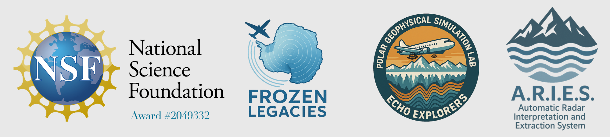

<p align="left">
  
  <span style="font-size:2em; vertical-align: middle;">
</p>

# ARIES — Automatic Radar Interpretation and Extraction System

**ARIES** is an advanced Python system for automatically processing and interpreting historical Z-scope radar sounding images (echograms) collected in the 1970s SPRI/NSF/TUD airborne radar surveys across Antarctica. The system uses computer vision and signal processing techniques to automatically detect ice surface and bed interfaces, providing quantitative ice thickness measurements.

---

## Table of Contents

- [Features](#-features)
- [Requirements](#-requirements)
- [Installation](#️-installation)
- [Usage](#-usage)
  - [Single Image Processing](#single-image-processing)
  - [Batch Processing](#batch-processing)
- [Configuration](#configuration)
- [Configuration Reference Sheet](#-configuration-reference-sheet)
- [Core Processing Pipeline](#-core-processing-pipeline)
- [Output Files](#-output-files)
  
---

## 🚀 Features

- **Automated Image Processing**: Load and preprocess historical Z-scope radar echograms with adaptive enhancement
- **Intelligent Feature Detection**: Automatically detect film artifact boundaries, transmitter pulse, and calibration pips
- **Advanced Echo Tracing**: Multi-scale adaptive algorithms for automatic surface and bed echo detection
- **Time Domain Calibration**: Precise time-to-depth conversion using calibration pip analysis
- **Coordinate Integration**: Full GPS coordinate interpolation using flight navigation data
- **Quality Validation**: Automatic validation and parameter optimization across image sequences
- **Comprehensive Output**: Enhanced CSV export with pixel coordinates, travel times, and ice thickness measurements
- **Interactive Refinement**: Click-based calibration pip selection with local refinement algorithms
- **Batch Processing**: Process entire flight directories with adaptive parameter learning
- **Modular Architecture**: Separate modules for artifact detection, calibration, feature detection, and visualization


---

## 📋 Requirements

### System Requirements
- **Python 3.8+** (Python 3.11 or 3.12 recommended for optimal performance)
- **Operating System**: Windows 10/11, macOS 10.14+, or Linux
- **RAM**: 8GB minimum, 16GB recommended for batch processing
- **Storage**: ~1GB per processed flight for output data

### Python Dependencies
- **Core Libraries**:
  - `numpy` - Numerical computing and array operations
  - `scipy` - Scientific computing and signal processing
  - `opencv-python` - Computer vision and image processing
  - `matplotlib` - Plotting and visualization
  - `pandas` - Data manipulation and CSV handling
  - `pathlib` - Modern file path handling

### Development Tools
- [VSCode](https://code.visualstudio.com/) (recommended for development and debugging)
- Git (for version control and updates) 

---

## 🛠️ Installation

### Quick Setup

1. **Clone the repository**:
```bash
git clone https://github.com/GT-PGSL/FrozenLegacies.git
cd "FrozenLegacies/Frozen Legacy Tools/Automatic Radar Interpretation and Extraction System (A.R.I.E.S.)"
```

2. **Create and activate virtual environment** (recommended):
```bash
# Windows
python -m venv aries_env
aries_env\Scripts\activate

# macOS/Linux  
python3 -m venv aries_env
source aries_env/bin/activate
```

3. **Install dependencies**:
```bash
pip install --upgrade pip
pip install numpy scipy opencv-python matplotlib pandas pathlib2
```

4. **Verify installation**:
```bash
python -c "import numpy, cv2, matplotlib, pandas, scipy; print('All packages installed successfully!')"
```

### Directory Structure
```
ARIES/
├── main.py                    # Main processing script
├── zscope_processor.py        # Core processor class
├── config/
│   ├── default_config.json    # Processing parameters
│   └── physical_constants.json # Physical constants
├── functions/                 # Modular processing functions
├── F125_Zscope/              # Sample data directory
└── output/                   # Processed results
```

---

## 📖 Usage

### Single Image Processing

Process a single Z-scope radar image with automatic feature detection:

```bash
python main.py <image_path> <output_dir> --nav_file <navigation_file>
```

**Arguments**:
- `<image_path>`: Path to radar image file (`.tiff`, `.png`, `.jpg`)
- `<output_dir>`: Directory for output files and results
- `<navigation_file>`: Flight navigation CSV file with GPS coordinates

**Example**:
```bash
python main.py F125_Zscope/F125-C0468_0481.tiff output --nav_file F125_Zscope/125.csv
```

### Batch Processing

Process multiple images in a directory with adaptive parameter learning:

```bash
python main.py --batch_dir <input_directory> <output_dir> --nav_file <navigation_file>
```

**Arguments**:
- `<input_directory>`: Directory containing multiple `.tiff` files
- `<output_dir>`: Directory for batch processing results
- `<navigation_file>`: Flight navigation CSV file

**Example**:
```bash
python main.py --batch_dir F125_Zscope output/F125_batch --nav_file F125_Zscope/125.csv
```

### Interactive Workflow

1. **Script launches** with image preprocessing and feature detection
2. **Calibration pip selection**: Click on the calibration pip location in the displayed image
3. **Automatic processing**: ARIES automatically detects surface and bed echoes
4. **Results display**: View the time-calibrated echogram with detected features
5. **Output generation**: Enhanced CSV and visualization files are saved automatically

### Command Line Options

- `--nav_file`: Navigation CSV file path (required for coordinate interpolation)
- `--batch_dir`: Enable batch processing mode for multiple files
- `--config`: Custom configuration file path (optional)


---

## Configuration

ARIES uses JSON configuration files to control processing parameters:

- **Processing parameters**: `config/default_config.json` - Main algorithm settings
- **Physical constants**: `config/physical_constants.json` - Radar wave velocity, ice properties

You can customize detection thresholds, search windows, and output settings by editing these files.

---

## 🔧 Configuration Reference Sheet

### Key Parameters in `config/default_config.json`

#### Adjusting Transmitter Pulse Detection
```json
"transmitter_pulse_params": {
    "search_height_ratio": 0.35,        // Higher = search deeper (0.2-0.5)
    "peak_prominence": 0.7,             // Higher = more selective (0.3-1.0) 
    "fallback_depth_ratio": 0.3,       // Fallback position if no peaks found
    "visualize_tx_pulse_detection": true // Enable debug visualization
}
```

**Quick Adjustments**:
- **Transmit pulse too high**: Decrease `search_height_ratio` to 0.25
- **Transmit pulse too low**: Increase `search_height_ratio` to 0.45  
- **No pulse detected**: Lower `peak_prominence` to 0.3-0.5

#### Surface Echo Detection Parameters
```json
"echo_tracing_params": {
  "surface_detection": {
    "search_start_offset_px": 355,      // Offset from transmit pulse (pixels)
    "search_depth_px": 150,             // Search window depth
    "peak_prominence": 30,              // Echo strength threshold
    "enhancement_clahe_clip": 2.8       // Image contrast enhancement
  }
}
```

**Quick Adjustments**:
- **Surface too close to transmit pulse**: Increase `search_start_offset_px` to 400-500
- **Surface too far from transmit pulse**: Decrease `search_start_offset_px` to 250-300
- **Missing weak surface echoes**: Lower `peak_prominence` to 15-25
- **Too many false surface detections**: Increase `peak_prominence` to 35-50
- **Adjust search window size**: Modify `search_depth_px` (100-250 typical range)

#### Bed Echo Detection Parameters  
```json
"echo_tracing_params": {
  "bed_detection": {
    "search_start_offset_from_surface_px": 495, // Offset from surface echo
    "search_end_offset_from_z_boundary_px": 22, // Distance from image bottom
    "peak_prominence": 95,                       // Echo strength threshold
    "enhancement_clahe_clip": 5.0               // Image contrast enhancement
  }
}
```

**Quick Adjustments**:
- **Bed too close to surface**: Increase `search_start_offset_from_surface_px` to 600-800
- **Bed too far from surface**: Decrease `search_start_offset_from_surface_px` to 300-400  
- **Missing weak bed echoes**: Lower `peak_prominence` to 50-70
- **Too many false bed detections**: Increase `peak_prominence` to 120-150
- **Adjust bottom boundary**: Modify `search_end_offset_from_z_boundary_px` (10-50 typical range)

#### Image Enhancement Settings
```json
"preprocessing_params": {
    "percentile_low": 2,                // Lower contrast percentile (1-5)
    "percentile_high": 98               // Upper contrast percentile (95-99)
}
```

**Quick Adjustments**:
- **Image too dark**: Increase `percentile_high` to 99
- **Image too bright/washed out**: Decrease `percentile_high` to 95-97
- **Need more contrast**: Adjust `percentile_low` to 1 and `percentile_high` to 99

### Quick Reference: Key Parameters by Section

| Section | Parameter | Purpose | Typical Range |
|---------|-----------|---------|---------------|
| **Transmitter Pulse** | `search_height_ratio` | Search depth from top | 0.2 - 0.5 |
| | `peak_prominence` | Detection sensitivity | 0.3 - 1.0 |
| **Surface Detection** | `search_start_offset_px` | Offset from TX pulse | 250 - 500 |
| | `search_depth_px` | Search window size | 100 - 250 |
| | `peak_prominence` | Echo strength threshold | 15 - 50 |
| | `enhancement_clahe_clip` | Contrast enhancement | 2.0 - 4.0 |
| **Bed Detection** | `search_start_offset_from_surface_px` | Offset from surface | 300 - 800 |
| | `search_end_offset_from_z_boundary_px` | Distance from bottom | 10 - 50 |
| | `peak_prominence` | Echo strength threshold | 50 - 150 |
| | `enhancement_clahe_clip` | Contrast enhancement | 3.0 - 6.0 |

### Parameter Adjustment Workflow

1. **Start with transmitter pulse**: Ensure it's correctly detected first
2. **Adjust surface detection**: Tune `search_start_offset_px` and `peak_prominence` based on ice type
3. **Refine bed detection**: Adjust `search_start_offset_from_surface_px` and prominence for bedrock visibility
4. **Fine-tune enhancement**: Modify `enhancement_clahe_clip` parameters for optimal echo visibility

### Common Parameter Combinations

| Ice Type | `search_start_offset_px` | `peak_prominence` | `search_start_offset_from_surface_px` | `peak_prominence` (bed) |
|----------|--------------------------|-------------------|---------------------------------------|-------------------------|
| **Thick Ice** | 355 | 30 | 495 | 95 |
| **Thin Ice** | 300 | 25 | 350 | 70 |
| **Noisy Data** | 400 | 40 | 550 | 120 |
| **Clear Data** | 320 | 20 | 450 | 60 |

---
## 🔧 Core Processing Pipeline

### 1. Image Preprocessing & Enhancement
- **Format Conversion**: 16-bit to 8-bit TIFF conversion with percentile normalization
- **Contrast Enhancement**: CLAHE (Contrast Limited Adaptive Histogram Equalization) 
- **Artifact Detection**: Automatic film artifact and sprocket hole boundary detection
- **Quality Assessment**: Image quality metrics and preprocessing optimization

### 2. Transmitter Pulse Detection
- **Search Window Definition**: Configurable search area in upper portion of image
- **Peak Detection**: Multi-scale peak prominence analysis with position weighting
- **Validation**: Automatic validation using expected pulse characteristics
- **Fallback Mechanisms**: Robust handling of difficult detection cases

### 3. Calibration Pip Detection
- **Interactive Selection**: User clicks approximate calibration pip location
- **Local Refinement**: Advanced computer vision algorithms for precise tick detection
- **Multi-Approach Detection**: Primary and aggressive detection methods with ranking
- **Time Calibration**: Conversion from pixels to microseconds using tick spacing

### 4. Automated Echo Tracing
- **Surface Echo Detection**: 
  - Multi-scale adaptive filtering and enhancement
  - Configurable search window offset from transmitter pulse
  - Peak prominence analysis with edge handling
  - Continuous trace validation and smoothing
- **Bed Echo Detection**:
  - Search window defined relative to detected surface
  - Enhanced contrast processing for weak bed returns
  - Robust detection in presence of noise and artifacts
  - Quality metrics and confidence scoring

### 5. Data Integration & Export
- **Time Domain Calibration**: Precise one-way travel time calculations using detected pips
- **Coordinate Interpolation**: High-resolution lat/lon interpolation from flight navigation
- **Physical Calculations**: Ice thickness in meters using electromagnetic wave propagation
- **Quality Assurance**: Automatic validation and parameter optimization for batch processing

--- 
## 📊 Output Files

For each processed image, ARIES generates comprehensive output files:

### 1. Enhanced Ice Thickness CSV: `{filename}_thickness.csv`
Contains full-resolution measurements with the following columns:
- **X (pixel)**: Horizontal pixel coordinate
- **Latitude**: High-precision interpolated coordinates (decimal degrees)
- **Longitude**: High-precision interpolated coordinates (decimal degrees)
- **CBD**: Control Block Distance navigation reference (where available)
- **Surface Depth (μs)**: One-way travel time to ice surface interface
- **Bed Depth (μs)**: One-way travel time to ice bed interface  
- **Ice Thickness (m)**: Calculated ice thickness using electromagnetic wave propagation

### 2. Calibrated Visualization Plots
- **`{filename}_picked.png`**: Main time-calibrated echogram with:
  - Detected transmitter pulse location
  - Calibration pip tick marks and time grid
  - CBD position labels with coordinates
  - Time and depth axis calibration
  
- **`{filename}_time_calibrated_auto_echoes.png`**: Echogram with automatic detections:
  - Automatically traced surface echo (green dashed line)
  - Automatically traced bed echo (magenta dashed line)
  - Detection confidence indicators
  - Processing parameter annotations

### 3. Quality Assurance & Debug Output
- **`{filename}_enhanced_local_refinement_validation.png`**: CBD detection validation
- **`debug_output/`** directory containing:
  - Transmitter pulse detection diagnostics
  - Echo tracing intermediate results  
  - Parameter optimization logs
  - Processing statistics and quality metrics

### 4. Batch Processing Summaries
For batch operations, additional files include:
- **Processing logs**: Success/failure statistics across image sequence
- **Parameter optimization**: Adaptive parameter updates for flight consistency
- **Quality reports**: Automated validation results and recommendations

### Example Output Structure
```
output/
├── F125-C0468_0481_thickness.csv                    # Main data export
├── F125-C0468_0481_picked.png                       # Calibrated visualization  
├── F125-C0468_0481_time_calibrated_auto_echoes.png  # Auto-detection results
├── F125-C0468_0481_enhanced_local_refinement_validation.png
└── debug_output/
    ├── F125-C0468_0481_transmitter_pulse_detection.png
    ├── F125-C0468_0481_surface_detection_debug.png
    └── F125-C0468_0481_bed_detection_debug.png
```

---

## 🔧 Troubleshooting

### Common Issues and Solutions

#### Detection Problems
- **Transmitter pulse not found**: 
  - Check `visualize_tx_pulse_detection: true` in config
  - Adjust `search_height_ratio` (try 0.25-0.45)
  - Lower `peak_prominence` to 0.3-0.5

- **Surface echo missing or incorrect**:
  - Verify transmitter pulse detection first
  - Adjust `search_start_offset_px` based on ice type
  - Lower `peak_prominence` for weak echoes
  - Check image quality and contrast settings

- **Bed echo not detected**:
  - Ensure surface echo is correctly detected
  - Increase `search_start_offset_from_surface_px` for thick ice
  - Lower `peak_prominence` for weak bed returns
  - Check `search_end_offset_from_z_boundary_px` setting

#### Image Quality Issues
- **Poor contrast**: Adjust `percentile_low` and `percentile_high` in preprocessing
- **Too much noise**: Increase `enhancement_clahe_clip` values
- **Artifacts interfering**: Check film artifact boundary detection parameters

#### Processing Errors
- **Import errors**: Verify all dependencies installed: `pip install numpy scipy opencv-python matplotlib pandas`
- **Memory issues**: Process images individually rather than batch mode
- **File path errors**: Use absolute paths and ensure directories exist

### Debug Mode
Enable detailed debugging by setting visualization flags to `true` in config files:
```json
"visualize_tx_pulse_detection": true,
"visualize_pip_detection": true,
"save_intermediate_plots": true
```

### Getting Help
1. Check the `debug_output/` directory for diagnostic plots
2. Review processing logs for specific error messages
3. Test with provided sample data first
4. Verify configuration parameters match your data characteristics

---

## 📈 Performance Notes

- **Processing Speed**: ~30-60 seconds per image depending on size and complexity
- **Memory Usage**: ~2-4GB RAM per image during processing
- **Batch Efficiency**: Adaptive parameter learning improves accuracy in batch mode
- **Output Size**: ~1-5MB per processed image (CSV + visualizations)

---

*Part of the FrozenLegacies project — preserving and analyzing historical Antarctic radar data for climate science research through advanced automated interpretation techniques.*

