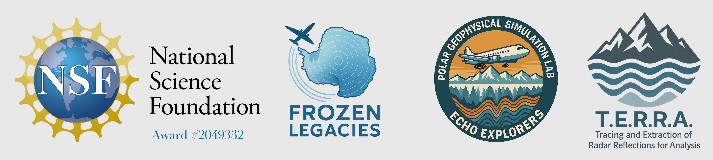

<p align="left">
  
  <span style="font-size:2em; vertical-align: middle;">
</p>

# TERRA — Tracing & Extraction of Radar Reflections for Analysis

**TERRA** is an interactive Python tool for digitizing surface and bed reflections from historical radar TIFF images and exporting geolocated picks and time‑domain products to CSV. It supports CBD labeling, optional calpip‑based travel‑time conversion, and high‑quality visualization outputs.

## 🚀 Quick Start

### Windows
```cmd
pip install opencv-python numpy pandas matplotlib pillow
python TERRA.py tiff "C:\TIFFs" output "C:\Results" nav "C:\Nav\125.csv"
```

### Mac  
```bash
pip install opencv-python numpy pandas matplotlib pillow PyQt5
python3 TERRA_Mac.py tiff "/path/to/TIFFs" output "/path/to/Results" nav "/path/to/Nav/125.csv"
```

---

## Table of Contents

- [Quick Start](#-quick-start)
- [Features](#-features)
- [Requirements](#-requirements)
- [Installation](#️-installation)
  - [Windows Installation](#windows-installation)
  - [Mac Installation](#mac-installation)
- [Usage](#-usage)
  - [Windows Usage](#windows-usage)
  - [Mac Usage](#mac-usage)
- [Core Processing Workflow](#-core-processing-workflow)
- [Output Files](#-output-files)
- [Notes](#-notes)
- [Troubleshooting](#-troubleshooting)

---

## 🚀 Features

- Interactive, polygon‑based digitization of **surface**, **bed**, and **transmitted pulse** regions
- CBD (Control Block Distance) label placement with optional **lat/lon interpolation** from flight CSVs
- **Calpip** detection workflow (user‑confirmed) for time‑domain calculations
- Automatic averaging of pixel intensities within drawn polygons
- **High‑DPI PNG** figure generation with dual y‑axes (depth/time)
- NaN‑tolerant handling of missing/undefined picks
- Batch processing across a directory of TIFFs

---

## 📋 Requirements

### System Requirements
- **Python 3.7+** (recommended: Python 3.8 or newer)
- **Operating System**: Windows 10/11 or macOS 10.14+

### Python Packages

**For Windows (`TERRA.py`)**:
- `opencv-python` - Computer vision and image processing
- `numpy` - Numerical computing
- `pandas` - Data manipulation and CSV handling
- `matplotlib` - Plotting and visualization
- `tkinter` - GUI framework (usually included with Python)
- `Pillow` (PIL) - Image processing and high-DPI output

**For Mac (`TERRA_Mac.py`)**:
- Same packages as Windows, plus:
- `PyQt5` - Cross-platform GUI framework (better Mac compatibility)

### Quick Install Commands

**Windows**:
```cmd
python -m ensurepip --upgrade
python -m pip install --upgrade pip
pip install opencv-python numpy pandas matplotlib pillow
```

**Mac**:
```bash
python3 -m ensurepip --upgrade
python3 -m pip install --upgrade pip
pip install opencv-python numpy pandas matplotlib pillow PyQt5
```

---

## 🛠️ Installation

TERRA runs as a single script; no package installation required.

### Windows Installation

1. **Install Python 3.x** (if not already installed):
   - Download from [python.org](https://python.org/downloads/)
   - During installation, check "Add Python to PATH"

2. **Open Command Prompt or PowerShell** and run:
```cmd
# Create virtual environment (recommended)
python -m venv terra_env
terra_env\Scripts\activate

# Install required packages
python -m ensurepip --upgrade
python -m pip install --upgrade pip
pip install opencv-python numpy pandas matplotlib pillow
```

3. **Verify installation**:
```cmd
python -c "import cv2, numpy, pandas, matplotlib, tkinter; print('All packages installed successfully!')"
```

### Mac Installation

1. **Install Python 3.x** (if not already installed):
   - Using Homebrew: `brew install python`
   - Or download from [python.org](https://python.org/downloads/)

2. **Open Terminal** and run:
```bash
# Create virtual environment (recommended)
python3 -m venv terra_env
source terra_env/bin/activate

# Install required packages
python3 -m ensurepip --upgrade
python3 -m pip install --upgrade pip
pip install opencv-python numpy pandas matplotlib pillow PyQt5

# For Mac compatibility, use TERRA_Mac.py which includes PyQt5 support
```

3. **Verify installation**:
```bash
python3 -c "import cv2, numpy, pandas, matplotlib; print('All packages installed successfully!')"
```

### File Structure
```
your_project_folder/
├── TERRA.py (Windows) or TERRA_Mac.py (Mac)
├── tiff_folder/
│   ├── F125-C0919_C0932.tiff
│   └── ... (more TIFF files)
├── nav_folder/
│   └── 125.csv (navigation file)
└── output_folder/ (created automatically)
```

---

## 📖 Usage

### Windows Usage

#### Recommended (labeled) CLI
1. **Open Command Prompt or PowerShell** in your project folder
2. **Activate environment**: `terra_env\Scripts\activate`
3. **Run**:
```cmd
python TERRA.py tiff "C:\path\to\tiff\directory" output "C:\path\to\output\directory" nav "C:\path\to\navigation.csv"
```

#### Legacy CLI
```cmd
python TERRA.py "C:\path\to\tiff\directory" "C:\path\to\output\directory" "C:\path\to\navigation.csv"
```

#### Example
```cmd
# Activate environment
terra_env\Scripts\activate

# Run TERRA with full paths
python TERRA.py tiff "C:\Data\TIFFs" output "C:\Results" nav "C:\Navigation\125.csv"
```

### Mac Usage

#### Recommended (labeled) CLI
1. **Open Terminal** in your project folder
2. **Activate environment**: `source terra_env/bin/activate`
3. **Run**:
```bash
python3 TERRA_Mac.py tiff "/path/to/tiff/directory" output "/path/to/output/directory" nav "/path/to/navigation.csv"
```

#### Legacy CLI
```bash
python3 TERRA_Mac.py "/path/to/tiff/directory" "/path/to/output/directory" "/path/to/navigation.csv"
```

#### Example
```bash
# Activate environment
source terra_env/bin/activate

# Run TERRA with full paths
python3 TERRA_Mac.py tiff "/Users/username/Data/TIFFs" output "/Users/username/Results" nav "/Users/username/Navigation/125.csv"
```

### Arguments
- **tiff** — Directory containing radar **TIFF** files to process
- **output** — Directory where **CSV** and **PNG** results will be saved  
- **nav** — Path to the **flight navigation CSV** (e.g., `125.csv`) used for CBD lat/lon lookup

### No‑argument Mode
Running with no arguments shows usage help and attempts to use default development paths.

---

## 🔧 Core Processing Workflow

1. **Load TIFFs** from the provided directory (processed one by one).
2. **CBD selection** — left‑click to add; right‑click when done.
3. **Surface polygons** — left‑click to draw; right‑click to close; **Enter** when all surfaces are finished.
4. **Bed polygons** — same interaction as surface.
5. **Transmitted pulse polygons** — same interaction; defines time zero for corrections.
6. **Calpips (optional)** — user confirms presence; calpip picker computes pixel spacing and y‑lines.
7. **CSV export** — per‑image CSV is written to the output directory.
8. **Visualization** — a high‑quality PNG is saved with picks, CBD labels, and y‑axis guides.

---

## 📊 Output Files

For each input TIFF:

1. **CSV** — `<filename>.csv` with geolocated picks and time‑domain products. Columns include:
   - **FLT**, **CBD_number**, **Latitude**, **Longitude**
   - **x_CBD_pixel_location**, **y_CBD_pixel_location**
   - **x_surface**, **y_surface**, **pixel_depth_surface**
   - **x_bed**, **y_bed**, **pixel_depths_bed**
   - **x_transmitted**, **y_transmitted**, **pixel_depth_transmitted**
   - **y_surface_corrected**, **y_bed_corrected**, **delta_y**
   - **surf_twt_us**, **bed_twt_us**, **h_ice_twt_us**
   - **surf_m**, **bed_m**, **h_ice_m**
   - **calpip_pixel_distance**

2. **PNG** — `<filename>.png` visualization with dual y‑axes (pixel/time) and CBD annotations.

> Notes:
> - Travel‑time and depth conversions are computed when calpips are available (velocity in ice set internally).
> - If navigation CSVs are missing or mismatched, lat/lon and/or CBD fields may be **NaN**.

---

## 📝 Notes

- **File naming**: TIFF files should follow the pattern `F{flight}-C{start}_{end}.tiff` (e.g., `F125-C0919_0932.tiff`) for robust parsing of **flight** and **CBD** ranges.
- **Navigation CSV**: Pass the specific flight CSV (`.../125.csv`) or a directory containing flight CSVs.
- **Output quality**: Figures are saved at high DPI via PIL when available; OpenCV fallback is used otherwise.
- **Platform differences**: Use `TERRA.py` for Windows (tkinter), `TERRA_Mac.py` for Mac (PyQt5).

### Platform-Specific Features

**Windows Version (`TERRA.py`)**:
- Uses `tkinter` for GUI components (built into most Python installations)
- Native Windows look and feel
- Optimized for Windows file path handling

**Mac Version (`TERRA_Mac.py`)**:
- Uses `PyQt5` for better Mac compatibility
- Enhanced cross-platform matplotlib backend (`Qt5Agg`)
- Better handling of Mac-specific display and font issues
- Automatic backend selection for optimal performance

---

## 🔧 Troubleshooting

### Common Issues

**Windows**:
- **"opencv not found"**: Ensure you installed `opencv-python` (not `cv2` or `opencv`)
- **"tkinter not found"**: Reinstall Python with "tcl/tk and IDLE" option checked
- **Permission errors**: Run Command Prompt as Administrator, or use `--user` flag: `pip install --user package_name`
- **Window sizing issues**: Adjust display scaling in Windows settings or use compatibility mode

**Mac**:
- **GUI not appearing**: Install PyQt5: `pip install PyQt5`
- **Backend errors**: Use `TERRA_Mac.py` instead of `TERRA.py` for Mac-specific compatibility
- **"python3 not found"**: Install Python via Homebrew: `brew install python`
- **Matplotlib display issues**: The Mac version automatically sets the Qt5Agg backend

**Both Platforms**:
- **"No TIFF files found"**: Ensure TIFF files have extensions: `.tif`, `.tiff`, `.TIF`, `.TIFF`
- **Navigation CSV issues**: Check that CSV has columns `CBD`, `LAT`, `LON` and matches flight number
- **Memory issues**: Close other applications; TERRA processes large radar images
- **Path issues**: Use absolute paths and ensure directories exist before running

### Interactive Controls
- **CBD Selection**: Left-click to mark CBD locations, right-click when done
- **Polygon Drawing**: Left-click to draw polygon boundaries, right-click to close polygon, Enter to finish all polygons
- **Phases**: Complete CBD → Surface → Bed → Transmitted Pulse → Calpip confirmation
- **Esc Key**: Cancel current operation or exit application

### Getting Help
If you encounter issues:
1. Check that all required packages are installed with correct versions
2. Verify Python version (3.7+ required)
3. Test package installation: `python -c "import cv2, numpy, pandas, matplotlib; print('OK')"`
4. Check file permissions and paths
5. Use absolute paths instead of relative paths

---

*Part of the FrozenLegacies project — preserving and analyzing historical Antarctic radar data for climate science research.*
